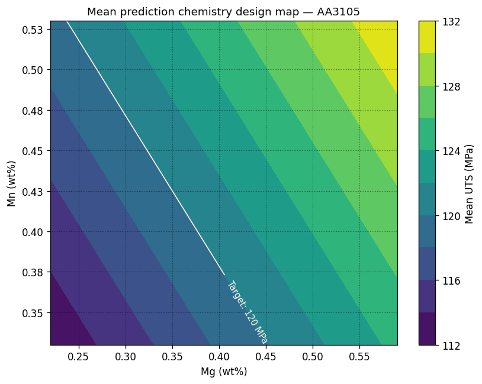
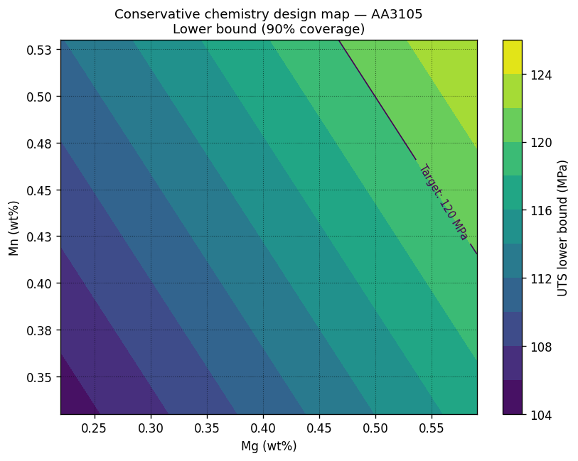

# SC05 — Uncertainty-Aware Chemistry Design Maps

> **Predictive models become decision tools only when uncertainty is made explicit. This study translates a validated chemistry-only UTS model into conservative, human-readable design maps that support robust engineering decisions.**

---

## 1. Why This Study Case Exists

Previous study cases established that:
- Chemistry contains sufficient signal to define **internal UTS standards** (SC02),
- The chemistry-based framework generalizes across systems, though not as a fixed formula (SC03),
- Adding process variables does not necessarily improve predictive robustness (SC04).

At this point, a new challenge emerges:

> **How can a validated predictive model be transformed into a tool that engineers can actually use to make conservative, defensible decisions?**

Regression coefficients, equations, and abstract metrics are rarely suitable for **day-to-day engineering work**, particularly when uncertainty must be considered explicitly.

This study case exists to **translate a chemistry-only model into decision-ready design artifacts**, without sacrificing rigor or interpretability.

---

## 2. Problem Framing and Hypothesis

### Strategic Problem

Point predictions alone are insufficient for engineering decisions.

In practice:
- Models are uncertain
- Errors are asymmetric in their consequences
- Decisions must be robust, not optimal on average

The strategic question addressed here is therefore:

> **Can a chemistry-only UTS model be expressed as a conservative design space that explicitly accounts for uncertainty and supports clear go / no-go decisions?**

### Hypothesis

> *By combining a stable chemistry-only model with an explicit uncertainty margin, it is possible to construct design maps that support conservative and interpretable engineering decisions.*

---

## 3. Design Philosophy and Principles

### 3.1 Models Must Be Translated, Not Exposed  
While regression models provide explicit mathematical formulations, these representations:
- Become unintuitive in multivariate settings
- Lose physical meaning after scaling or normalization
- Are poorly suited for collaborative engineering decisions

Design maps act as a **translation layer** between mathematical models and human reasoning.

### 3.2 Conservative Decisions Require Explicit Uncertainty  
Ignoring model uncertainty leads to false precision.

In this study, uncertainty is treated as:
- Explicit
- Quantified
- Central to decision-making

### 3.3 Robustness Over Nominal Optimality  
Design choices prioritize:
- Stability,
- Interpretability,
- Margin,

over marginal gains in nominal predictive accuracy.

---

## 4. Methodological Decisions (What We Chose — and Why)

- **System:** AA3105-O
- **Features:** Mg, Mn (chemistry-only, frozen baseline)
- **Model:** Ridge regression
- **Validation:** Group-aware cross-validation by heat
- **Uncertainty estimation:** Global margin derived from out-of-fold residuals

The uncertainty margin is defined using a simple, conservative rule derived from historical out-of-fold errors:

Uncertainty is estimated using a **conformal-style global margin**:

$$
q = \mathrm{Quantile}_{1-\alpha}\left(|y - \hat{y}_{\mathrm{OOF}}|\right)
$$

This defines a conservative lower bound:

$$
\hat{y}_{\text{lower}} = \hat{y} - q
$$

The margin is intentionally global to preserve stability and interpretability of the resulting design maps.

> Portfolio-wide assumptions and conventions are documented in  
> → [`README_EXTENDED.md`](https://github.com/ivvza-io/analytics-engineering-portfolio/tree/main/docs/README_EXTENDED.md)   
> Design rationale, methodological decisions, and implementation-level technical documentation are maintained in  
→ [`docs/technical-notes`](https://github.com/ivvza-io/sc05-uncertainty-aware-design-maps/tree/main/docs/technical_notes.md)

---

## 5. Key Results and Design Artifacts

Among the generated artifacts, the **robust design region** constitutes the primary decision tool.  
All other maps are supporting surfaces intended to provide context, diagnostics, or justification.

### 5.1 Design Map Domain

Design maps are generated within a **data-supported chemistry window** (p05–p95 for Mg and Mn) to:
- Minimize extrapolation
- Ensure physical relevance
- Maintain defensibility

---

### 5.2 Mean Prediction Map

This surface is provided for interpretive context only and is **not intended to support decisions directly**.

**Figure 1 — Mean UTS prediction surface**

> Provides global trend context, not a decision rule.

---

### 5.3 Conservative Lower-Bound Map

**Figure 2 — Conservative lower-bound UTS surface (ŷ − q)**

> Represents the minimum expected UTS under the selected uncertainty margin.

---

### 5.4 Robust Design Region

**Figure 3 — Robust design region for target UTS**

$$
\mathrm{Robust}(x) = \mathbb{1}\left[\hat{y}_{\text{lower}}(x) \ge T\right]
$$

This map:
- Converts model output into a clear go / no-go rule
- Eliminates the need to interpret coefficients or equations
- Is directly usable in engineering discussions

---

### 5.5 Uncertainty Diagnostic

**Figure 4 — Out-of-fold prediction band (±q)**

> Confirms that the selected margin behaves conservatively on unseen heats.

---

### 5.6 Model Choice for Map Geometry

**Figure 5 — Lower-bound comparison: Ridge vs Polynomial**

Ridge is preferred due to:
- Smoother boundaries
- Greater geometric stability
- Higher interpretability for engineering use

---

## 6. Engineering Interpretation

These design maps support **early- and mid-stage engineering decisions**, including:
- Defining conservative chemistry windows
- Screening heats prior to execution
- Supporting cross-functional discussions between metallurgy and process teams

Key observations:
- Mg dominates the chemistry-driven envelope
- Mn provides secondary modulation
- Robust regions encode uncertainty-aware decision rules

---
## 7. How to Read and Use the Design Maps

The design maps are intended as **decision-support tools**, not as exact predictors.

To use the maps correctly:

- **Identify the chemistry point** (Mg, Mn) corresponding to the heat or design under evaluation
- **Select the appropriate target UTS level** based on internal requirements
- **Check whether the point lies inside the robust region**, where the conservative lower bound exceeds the target

Interpretation rules:
- Points **inside** the robust region satisfy the target with margin under the selected uncertainty level
- Points **outside** the robust region may still meet the target on average, but without conservative guarantees
- Boundaries should be interpreted as **transition zones**, not sharp physical limits

The maps are designed to support early-stage screening and conservative decision-making, not to replace detailed engineering analysis.

---

## 8. Operational Guardrails: When NOT to Use the Design Maps

The design maps are valid only under specific conditions.  
They should **not** be used in the following situations:

- **Extrapolation outside the observed chemistry domain**  
  The maps are constructed within the p05–p95 chemistry window. Predictions outside this region are not supported by data.

- **Chemistries outside internal or external specification ranges**  
  The maps assume that evaluated points are metallurgically feasible and within acceptable composition limits.

- **Significant process changes**  
  Changes in casting practice, rolling schedules, heat treatment, or equipment may invalidate the historical chemistry–UTS relationship.

- **Non-comparable product routes or tempers**  
  The maps are specific to the analyzed system and temper; applying them to different routes requires revalidation.

- **Release-grade or final quality decisions**  
  These maps are not intended to replace mechanical testing or formal release criteria.

Explicitly defining when **not** to use the maps is essential to prevent misuse and overconfidence.

---

## 9. What This Study Case Is — and Is Not

### This Study *Is*:
- A translation of predictive modeling into a **decision-ready artifact**
- A conservative, uncertainty-aware framework
- A **bridge** between **data science** and **engineering practice**

### This Study *Is Not* :
- A release-grade quality decision system
- A local or heteroscedastic uncertainty model
- A replacement for detailed process modeling

---

## 10. Limitations and Guardrails

More sophisticated uncertainty treatments were intentionally deferred to preserve interpretability and practical usability.  
Detailed methodological discussion is documented in the Technical Notes.

---

## 11. Why This Study Case Matters in the Portfolio

This study case completes the portfolio arc:

1. **SC02:** Chemistry can support internal standards
2. **SC03:** Standards generalize as frameworks, not formulas
3. **SC04:** Added variables do not guarantee robustness
4. **SC05:** Standards become usable only when uncertainty is explicit

It demonstrates how **data analysis** can be **translated** into **engineering decision tools**.

---

## 12. Decision Summary

- **Design model:** Ridge regression
- **Uncertainty treatment:** Global conformal-style margin
- **Primary deliverable:** Robust chemistry design maps

This combination maximizes interpretability, robustness, and practical usability.

---

## References and Related Work

- Portfolio assumptions and conventions:  
  → [`README_EXTENDED.md`](https://github.com/ivvza-io/analytics-engineering-portfolio/blob/main/docs/README_EXTENDED.md)
- Chemistry-only standard definition:  
  → [`SC02 — Chemistry-Only Modeling of UTS`](https://github.com/ivvza-io/sc02-chemistry-only-mechanical-properties)
- Chemistry generalization across systems:  
  → [`SC03 — Chemistry Generalization Across Systems`](https://github.com/ivvza-io/sc03-chemistry-generalization-across-systems)
- Variable influence screening:  
  → [`SC04 — Variable Influence Screening`](https://github.com/ivvza-io/sc04-variable-influence-screening)

---

### Takeaway

This study shows that **explicit uncertainty is what turns models into decisions**.  
The goal is not perfect coverage, but **defensible, conservative engineering guidance**.
For day-to-day engineering decisions, **models** are most effective when **expressed as human-readable design maps**, not as raw equations or coefficients.